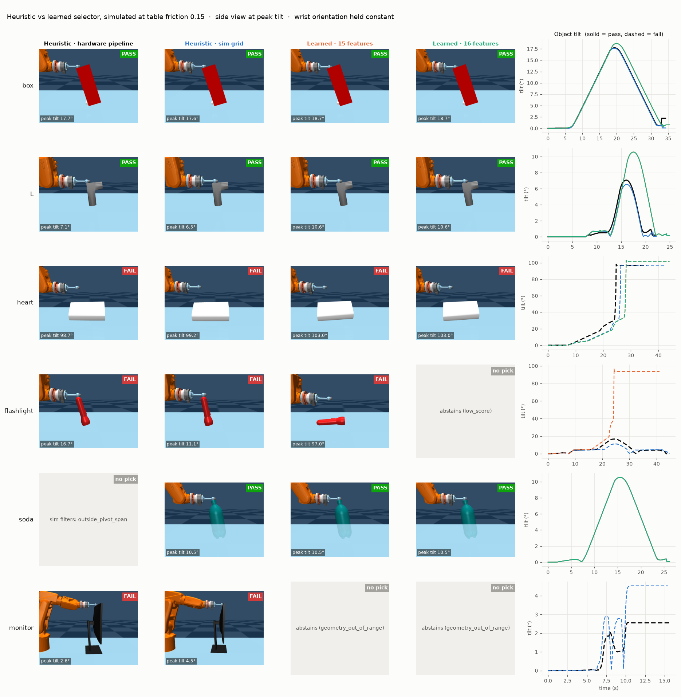

# Contact selection

Where should the press-pull controller press on top of an object so that it tips?
The wrist holds a **constant orientation** throughout the press and the pull.

**[Results →](RESULTS.md)** (all figures live in [figures/](figures/))

## How it works

1. **Candidates.** Sample a grid on the top surface and keep the reachable,
   collision-free points.
2. **Labels.** Run the press-pull controller at every candidate under several
   physics scenarios (friction, mass, force). A candidate is *robust* only if it
   passes all of them.
3. **Selectors.**
   - The hardware rule, dz − w·dx (`hardware/hardware_selector.py` is a verbatim
     copy).
   - Logistic models over geometry only.
4. **End to end.** Ray-cast camera clouds and run the hardware pipeline on them
   (`cloud-parity --execute`).

| Folder | Contents |
|---|---|
| `sim/` | scene, physics presets, candidate grid, rollout + feasibility labels |
| `selection/` | features, logistic selector, heuristic rule |
| `hardware/` | verbatim hardware selector, simulated camera clouds |
| `commands/` | one module per CLI command |
| `figures/` | generated PNGs shown in [RESULTS.md](RESULTS.md) |

## Commands

Run from the repo root, using `.venv/bin/python -m contact_selection <cmd>`:

| Command | Does | Default output |
|---|---|---|
| `rerun --name X` | full suite (~9 GB) | `suites/YYYY-MM-DD_X/` |
| `generate --config C` | one config sweep | `sweeps/YYYY-MM-DD_C/` |
| `replay RUN --candidate N` | MP4 of one contact | beside the scene |
| `compare SUITE` | all selectors × label scopes | `SUITE/selector_comparison_DATE.json` |
| `cloud-parity SUITE --execute` | hardware pipeline on sim clouds | `SUITE/cloud_parity_DATE.json` |
| `figures SUITE` | outcome, contact-map and parity figures | `figures/` |
| `sim-compare ROOTS…` | heuristic vs learned, simulated and rendered | `figures/sim_compare.png` |

Outputs are under `outputs/contact_selection/`. See also the
[configs](config/README.md).

## Scope

- **No physics in.** The selector runs before contact, so it never takes
  friction or mass as inputs. Friction is per object and is an estimator
  output. The physics scenarios enter only through the robust label.
- **2D CoM is given.** In the full system it would come from planar pushing,
  which is outside this paper.
- **Future work:** real2sim plus active learning from real interactions.
