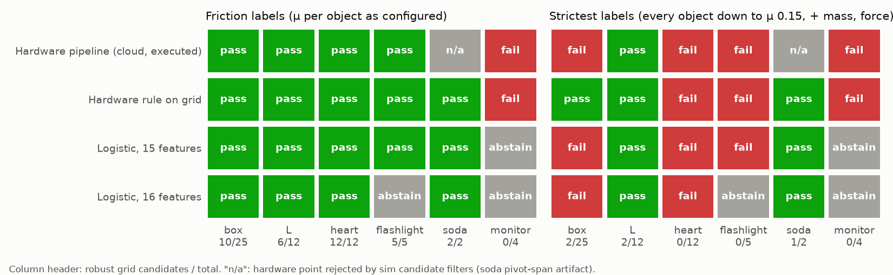
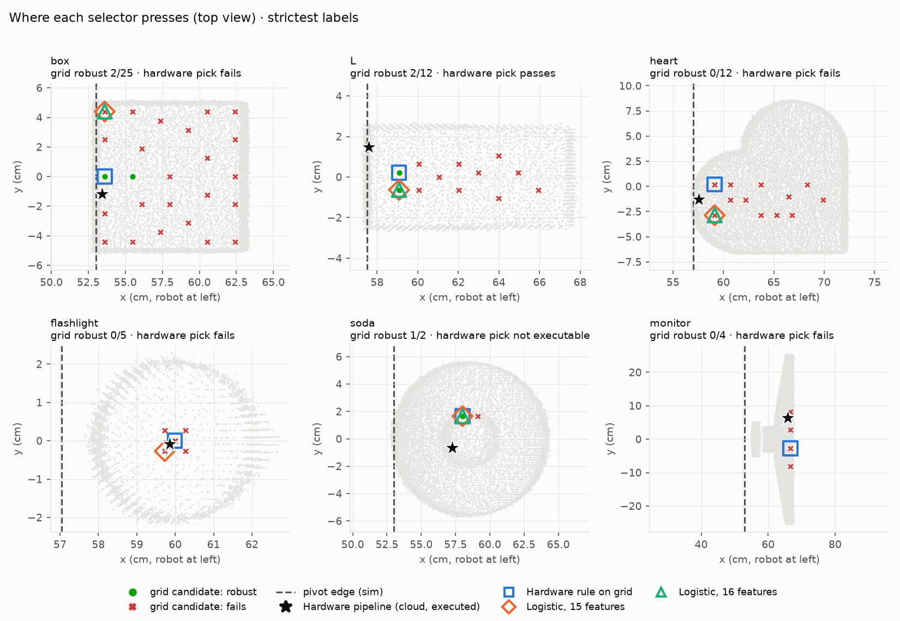
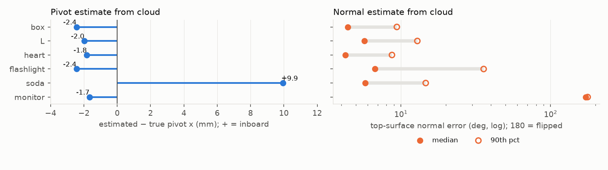

# Contact selection results (2026-10-05)

The wrist holds a constant orientation in every rollout. A rollout counts as a
pass only if the object tips and is set back down: toppling is a failure.

## Heuristic vs learned, simulated (table friction 0.15)


- **box, L:** all four picks pass.
- **heart:** every pick topples it.
- **flashlight:** every pick slides. The 16-feature model declines to press.
- **soda:** the grid picks pass. The hardware point is rejected by a sim filter,
  because the soda's collision hull is off-centre.
- **monitor:** the heuristic fails; the learned models decline to press.
- **Verdict:** the heuristic matches the learned models. The models' only extra
  is declining to press.

## All scenarios (friction, mass ×0.5/×2, force ×2.6)



Under the strictest labels, the heuristic's grid pick passes box, L and soda.
The learned models pass only L and soda: their box pick topples at μ 0.15 with
half mass.

## Where each selector presses



## Perception error (hardware pipeline on simulated clouds)



- The pivot comes out about 2 mm outboard. Soda's +10 mm is the chord of a
  round base, not noise.
- The monitor's normals are flipped by the convex-object assumption in
  `estimate_normals`.
- The camera poses are approximate.

## Regenerate

```bash
S=outputs/contact_selection/suites/2026-10-05_mass_force; P=outputs/contact_selection/probes
X="--extra $P/2026-10-05_mass_force_low_friction $P/2026-10-05_matched_friction"
M15=outputs/contact_selection/suites/2026-09-30_friction/geometry_selector/model.json
M16=$S/geometry_selector_ray_toppled_fix/model.json
.venv/bin/python -m contact_selection cloud-parity $S --labels $S/features_ray $X --execute
.venv/bin/python -m contact_selection figures $S --labels $S/features_ray $X --friction-selector $M15 --model16 $M16
.venv/bin/python -m contact_selection sim-compare $S $P/2026-10-05_matched_friction --model15 $M15 --model16 $M16
```
