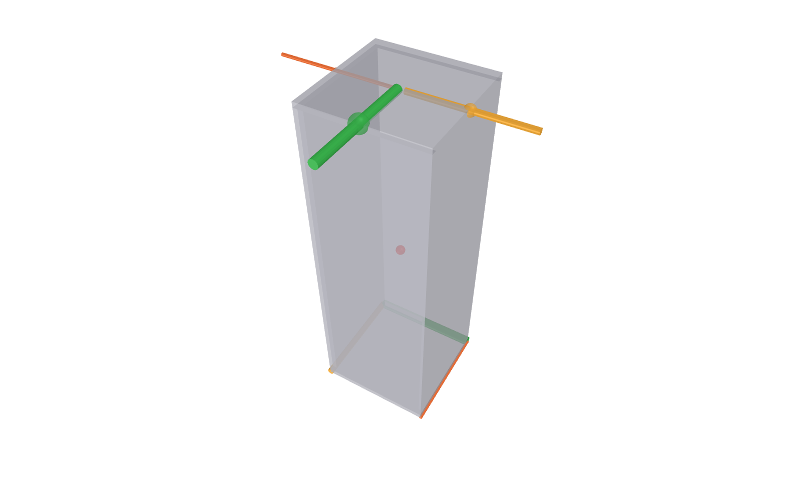
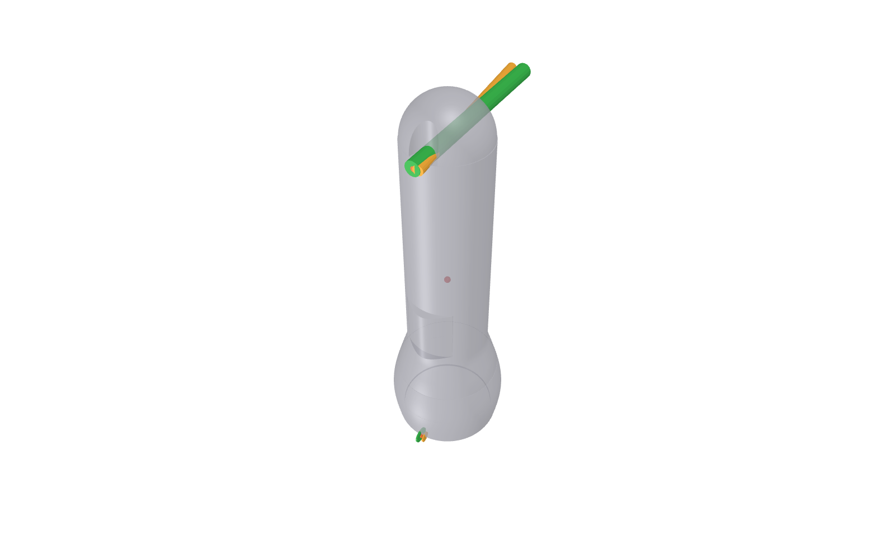
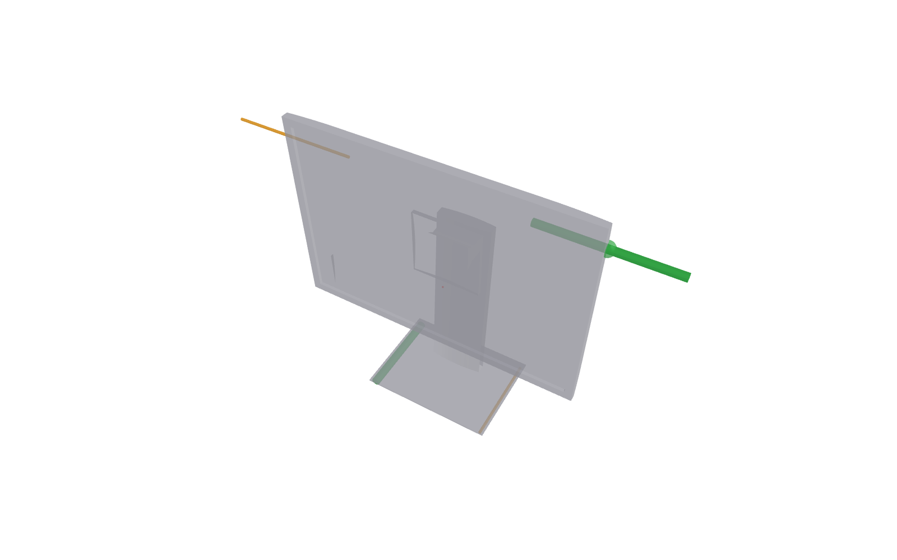

# Push Selection Pipeline

Automatic selection of a tipping edge and push contact configuration from an object mesh.

## Files

| File | Description |
|------|-------------|
| push_selection_pipeline.py | Core geometry pipeline, scoring, visualization, and PNG export |
| run_push_selection.py | Batch runner for the four experiment meshes and per-object PNG output |

## Pipeline Used In Code

Given a mesh and a 2D CoM (from `mesh.center_mass[:2]`), the current pipeline is:

1. Extract support polygon from bottom vertices (support plane near `z = 0`) and compute candidate tip edges.
2. Rank tip edges by CoM proximity (`d_perp_to_com`), then keep the top `K` edges.
3. Extract top-band convex hull vertices (top fraction of object height).
4. For each candidate tip edge, pair to a push point using perpendicular slab projection.
5. Score each push-tip pair and rank descending.
6. Optionally enforce LoA as a hard constraint (`--no-enforce-loa` disables this).
7. Visualize top-ranked valid candidates and export PNG.

## Pair Selection Theory

For each tip edge, the algorithm constructs a local 2D frame:

- along-axis: unit vector along the tip edge.
- perp-axis: tip inward normal (perpendicular to the tip edge, pointing into the object).

Each top-band hull vertex is projected onto these two axes:

- `along_proj`: where the point falls along the tip edge span.
- `perp_proj`: signed perpendicular distance from the tip edge line.

The pair is selected by geometric constraints:

1. Slab filter: keep vertices with `along_proj` inside the edge extent (`0` to `edge_length`).
2. Far-side filter: keep vertices with `perp_proj > 0` (inward side of the object).
3. Choose the furthest valid point (maximum `perp_proj`), then use midpoint-clamped interpolation for a stable contact point.

Why this makes sense physically:

- Push direction is perpendicular to tip edge by construction, maximizing tipping moment arm directionality.
- Selecting the furthest inward point increases effective moment arm for rotation about that edge.
- Restricting to slab points avoids pairing to unrelated geometry outside the lateral span of the candidate edge.

This produces at most one geometry-derived push candidate per tip edge.

## Scoring Metric

Each surviving pair is scored as:

`total = w_orth * s_orth + w_tip * s_tip + w_lev * s_lev + w_edge * s_edge + w_loa * s_loa`

Default weights in code:

- `w_orth = 5.0`
- `w_tip = 4.0`
- `w_lev = 1.5`
- `w_edge = 1.0`
- `w_loa = 3.0` (only contributes when LoA is enforced)

Term definitions:

- `s_orth`: orthogonality score from pairing step. In current perpendicular-slab pairing, `s_orth = 1.0` by construction.
- `s_tip = 1 / (1 + 20 * d_perp_to_com)`.
  - Favors tip edges whose line is closer to projected CoM (easier to tip).
- `s_lev = push_height / object_height`.
  - Favors higher pushes (larger torque lever arm relative to base).
- `s_edge = tip_edge_length / max_tip_edge_length`.
  - Favors longer support edges (more stable and practical contact geometry).
- `s_loa = 1 - (loa_offset / loa_epsilon)` when LoA is enforced.
  - Favors lines of action that pass close to CoM projection.

LoA enforcement behavior:

- If `enforce_loa=True`, pairs with `loa_offset > loa_epsilon` are rejected.
- If `enforce_loa=False`, no hard LoA rejection is applied and push direction is inward normal.

## Why A Pair Is Selected

A high-ranked pair typically has all of the following:

1. Tip edge near CoM projection (high `s_tip`).
2. Push contact high on object (high `s_lev`).
3. Geometrically meaningful opposite-side push point from slab projection.
4. Long candidate tipping edge (high `s_edge`).
5. If LoA is on: push line passes near CoM (high `s_loa`).

The ranking is therefore a blend of geometric feasibility and tipping effectiveness, not just nearest-distance heuristics.

## Batch Runner Usage

Run from repository root:

```bash
python push_selection/run_push_selection.py
```

Or from the push_selection folder:

```bash
python run_push_selection.py
```

Supported flags:

```bash
python run_push_selection.py --loa-epsilon 0.02
python run_push_selection.py --top-k 3
python run_push_selection.py --output-dir ../figures/push_selection
```

Notes:

1. The runner always processes box, heart, flashlight, and monitor.
2. Output defaults to the push_selection folder.
3. PNG export uses a fixed isometric-like camera setup.

## Programmatic Usage

```python
import numpy as np
from push_selection_pipeline import load_object_mesh, select_push_config, visualize_ranked_pairs

mesh = load_object_mesh("path/to/object.stl")
com = mesh.center_mass
com_2d = np.array([com[0], com[1]], dtype=float)

ranked = select_push_config(mesh, com_2d, verbose=True)
visualize_ranked_pairs(
   mesh,
   ranked,
   com_2d,
   top_n=3,
   show=False,
   save_png_path="object.png",
)
```

## Figures

### Box



### Heart


### Flashlight



### Monitor



## Dependencies

```bash
pip install trimesh numpy scipy
```
